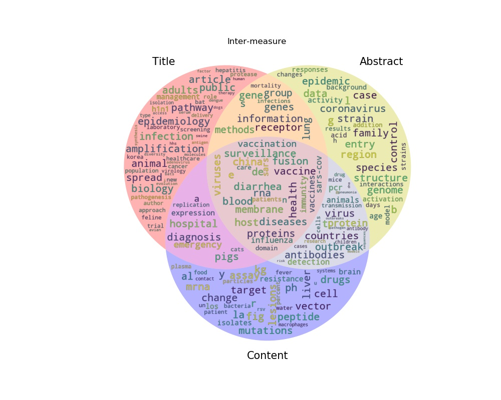

# matplotlib venn wordcloud in python inspired by 
This repo describes how you can custom venn diagram for great illustration
# git clone https://github.com/rdius/venn_wordcloud.git
# git add *
# git commit -m "commit message"
# git push origin main or master
After editing on github, pull it before any new commit
# git pull https://github.com/rdius/venn_wordcloud.git 

Plot a Venn diagram based on two sets of words.
The words are plotted as a word cloud on top.



Depends on [matplotlib-venn](https://github.com/konstantint/matplotlib-venn)
and [wordcloud](https://github.com/amueller/word_cloud) and their dependencies for the heavy lifting.

## Example

``` python
from venn_wordcloud import venn2_wordcloud

test_string_1 = "Lorem ipsum dolor sit amet, consetetur sadipscing elitr, sed diam nonumy eirmod tempor invidunt ut labore et dolore magna aliquyam erat, sed diam voluptua."

test_string_2 = "At vero eos et accusam et justo duo dolores et ea rebum. Stet clita kasd gubergren, no sea takimata sanctus est Lorem ipsum dolor sit amet."

# tokenize words (approximately at least):
sets = []
for string in [test_string_1, test_string_2]:

    # get a word list
    words = string.split(' ')

    # remove non alphanumeric characters
    words = [''.join(ch for ch in word if ch.isalnum()) for word in words]

    # convert to all lower case
    words = [word.lower() for word in words]

    sets.append(set(words))

# create visualisation
venn2_wordcloud(sets)
```
You can also run [examples.py](./matplotlib_venn_wordcloud/examples.py) as main.

``` 
    python examples.py
```
## Installation

Easiest via pip:

``` shell
pip install matplotlib_venn_wordcloud
```
